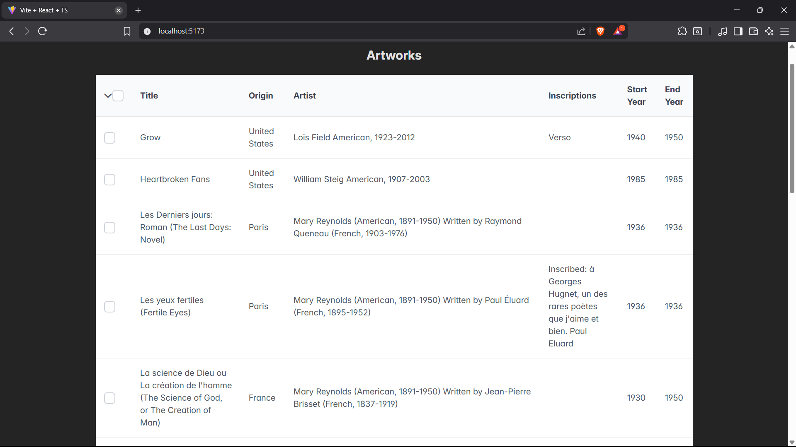
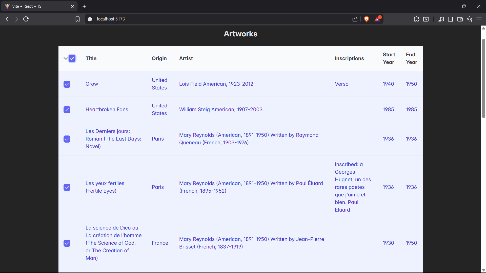

<<<<<<< Updated upstream
# 🎨 ArtWorks – React Internship Assignment
=======
# 🎨 ArtWorks Viewer – React Internship Assignment
>>>>>>> Stashed changes

This is a React + TypeScript project built using Vite and PrimeReact as part of an internship assignment. The app fetches artwork data from the Art Institute of Chicago API and displays it in a PrimeReact `DataTable` with features like server-side pagination, checkbox selection, and custom row selection logic that persists across pages.

---

## 📌 Features Implemented

- ✅ **Built with Vite + TypeScript**
- ✅ **PrimeReact DataTable**
- ✅ **Server-side pagination**
- ✅ **Row selection via checkboxes only**
- ✅ **Selection persists across page changes**
- ✅ **Custom selection panel (below table)**
- ✅ **Overlay panel with “Select Top N” logic**
- ✅ **Selection is limited to IDs only (no full data stored)**
- ✅ **Proper API calls on every page (no page caching)**

---

## 🔗 API Used

[https://api.artic.edu/api/v1/artworks?page=1](https://api.artic.edu/api/v1/artworks?page=1)

Fields displayed:
- `title`
- `place_of_origin`
- `artist_display`
- `inscriptions`
- `date_start`
- `date_end`

---

## 📸 Screenshots

| Table with pagination and selection | Custom selection panel |
|------------------------------------|-------------------------|
|  |  |


---
🔗 Live App: [https://incredible-cactus-ed9d26.netlify.app/](https://incredible-cactus-ed9d26.netlify.app/)


## 🚀 How to Run Locally

```bash
# Clone the repo
git clone https://github.com/your-username/art-gallery-assignment.git
cd art-gallery-assignment

# Install dependencies
npm install

# Start dev server
npm run dev
